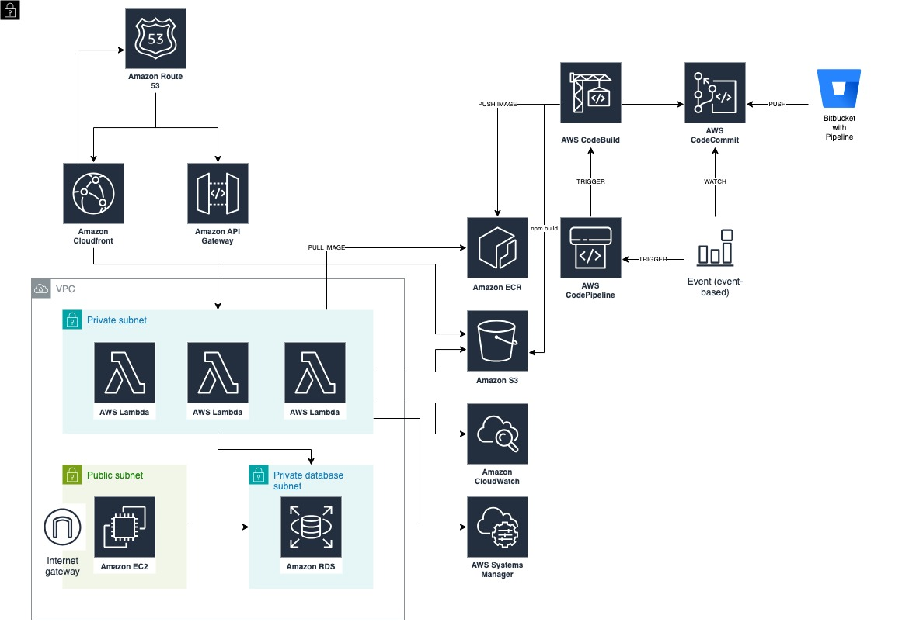

# Cloud ERP

## Description
In this project, all details of AWS invoices (VAT, Declaration, Marketplace, Credit Note) issued monthly in PDF format to customers receiving "AWS reseller" service are parsed and converted into information according to company accounting rules, and transactions such as uploading the invoices to the FTP accounts of banks are carried out so that automatic payment instructions, if any, can be applied.

## Diagram

## Tech Stack
* Cloud
    * Amazon Route53
    * Amazon CloudFront
    * Amazon API Gateway
    * AWS Lambda
    * Amazon EC2
    * Amazon RDS
    * Amazon ECR
    * Amazon S3
    * Amazon CloudWatch
    * AWS Systems Manager
* DevOps
    * AWS CodeCommit
    * AWS CodeBuild
    * AWS CodePipeline
    * Bitbucket Pipeline
    * AWS CDK
    * Terraform
* Coding
    * BASH
    * Python
    * Go
* Other
    * PostgreSQL