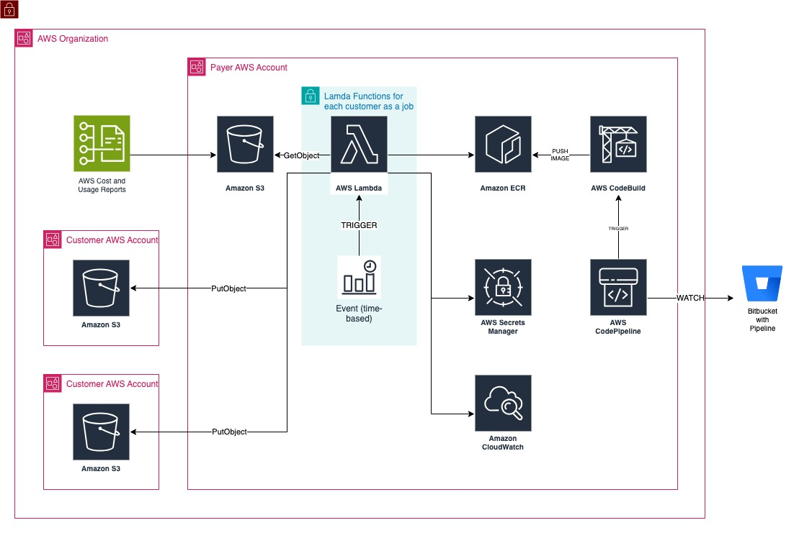

# CUR Manager

## Description
In this project, I took part in determining the architecture, developing IaaC and developing the Lambda backend (serverless) with the Pandas library in a big data environment to automate the process of sharing monthly cost reports generated by AWS, after deducting our profit margins, discounts, etc., to our customers to whom we provide "AWS resell" service.

## Diagram

## Tech Stack
* Coding
    * Python
* Amazon Web Services
* Other
    * Bitbucket Pipeline
    * Terraform