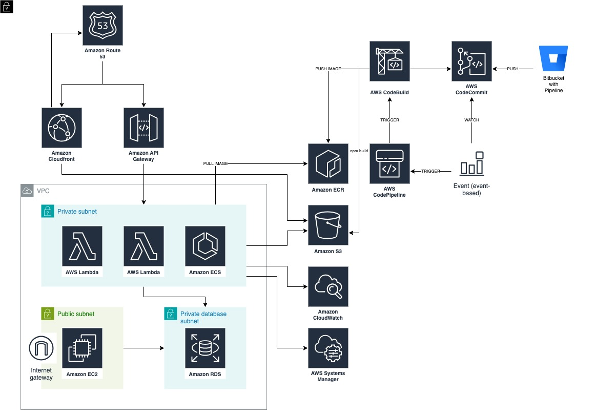

# Managed Services Portal

## Description
In this project, services such as monitoring of customers receiving managed service, consultancy service invoices, automated report results of the application called Steampipe, which generates cost optimization and security reports, and cost explorer are offered.

## Diagram

## Tech Stack
* Coding
    * BASH
    * Python
    * Go
* Amazon Web Services
    * https://github.com/BeratNzp/project-diagrams/blob/master/msp.jpg
* Other
    * Bitbucket Pipeline
    * AWS CDK
    * Terraform
    * Steampipe
    * PostgreSQL