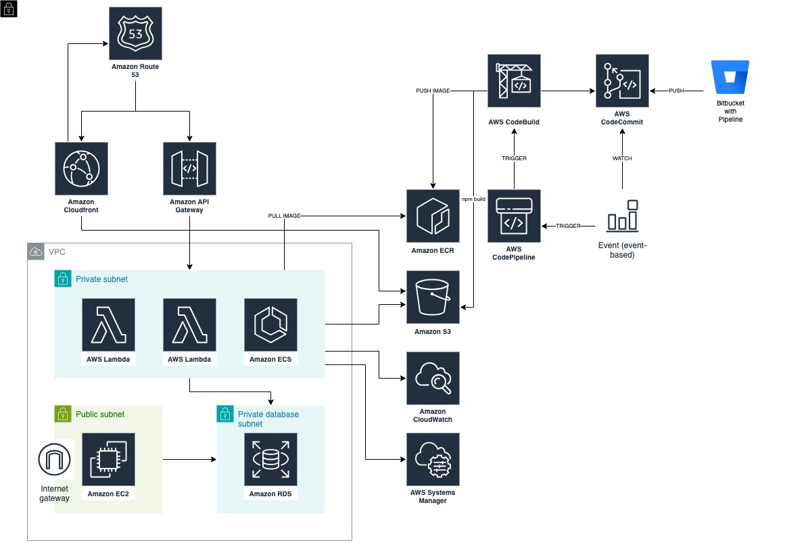

# Managed Services Portal

## Description
In this project, services such as monitoring of customers receiving managed service, consultancy service invoices, automated report results of the application called Steampipe, which generates cost optimization and security reports, and cost explorer are offered.

## Diagram

## Tech Stack
* Cloud
    * Amazon Route53
    * Amazon CloudFront
    * Amazon API Gateway
    * AWS Lambda
    * Amazon EC2
    * Amazon RDS
    * Amazon ECR
    * Amazon S3
    * Amazon CloudWatch
    * AWS Systems Manager
* DevOps
    * AWS CodeCommit
    * AWS CodeBuild
    * AWS CodePipeline
    * Bitbucket Pipeline
    * AWS CDK
    * Terraform
* Coding
    * BASH
    * Python
    * Go
* Other
    * Steampipe
    * PostgreSQL