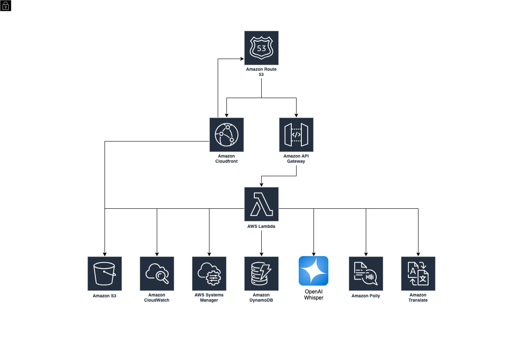

# Translator Project

## Description
**Translator** is an Android mobile application that provides instant voice and text translation for customers and sellers speaking different languages.

It was developed by a different team within the company for a famous textile company in Turkey, but it has not been completed.

In this project, debugging was done and the related problems were solved by contacting the backend team and the cloud architecture was developed and implemented and IaaC was developed.

## Diagram

## Tech Stack
* Amazon Web Services
* Other
    * Terraform
    * OpenAI Whisper
    * MVN